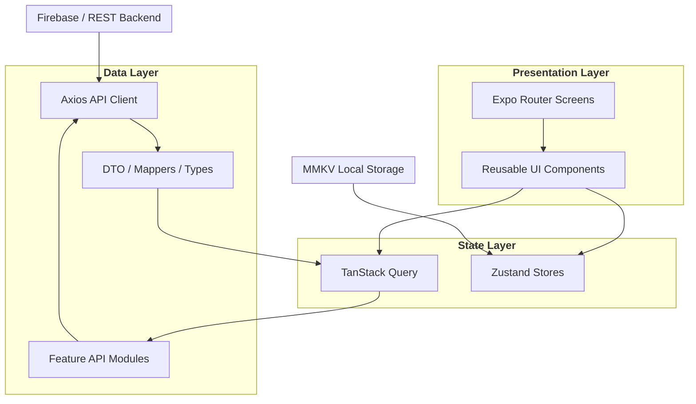

# Bookly Stay


Bookly is a **demo booking mobile application** built with React Native + Expo to showcase feature-first organization, modern mobile architecture, and production-ready patterns.

> ⚠️ This app is for **demonstration purposes only**. No real payments, reservations, or transactions are processed.


## 📑 Table of Contents

- [Overview](#-overview)
- [Screenshots](#-screenshots)
- [Key Features](#-key-features)
- [Architecture](#-architecture)
- [Technical Decisions](#-technical-decisions)
- [Getting Started](#-getting-started)
- [Testing](#-running-the-tests)
- [Author](#-author)

## ✨ Overview

Bookly simulates a complete accommodation booking experience, including authentication, destination search, hotel discovery, and reservation confirmation.

The project is structured to reflect real-world mobile applications, prioritizing:

- Feature-based organization
- Clear separation of concerns
- Scalable routing and state management
- Maintainable and testable architecture

## 📸 Screenshots

<table style="border-style: none; border-color: transparent;">
  <tr>
    <td></td>
    <td></td>
    <td></td>
    <td></td>
    <td></td>
  </tr>
</table>

## 📱 Key Features

- **Authentication:** Email/password and social sign-in.
- **Destination Discovery:** Search locations, view top destinations, and use geo-based suggestions.
- **Accommodation Catalog:** Browse, sort, and open hotel details with rich sections.
- **Booking & Checkout:** Pick dates/occupancy, review details, and confirm a mocked reservation.
- **Bookings Management:** Track active and past bookings from the dedicated tab.
- **Feedback Loop:** Built-in bug reporting flow.

## 🧪 Try the App (Closed Test)

You can install the Bookly app directly on your device via the closed test builds.

👉 [Bookly – Closed Test Page](TODO)

## 🧱 Tech Stack

- **React Native & Expo**
- **State management:** `zustand` (client state) + `@tanstack/react-query` (server state)
- **Navigation:** `expo-router`
- **Networking:** `axios`
- **Forms & validation:** `react-hook-form` + `zod`
- **Styling:** `nativewind`
- **Localization:** `i18next`
- **Local storage:** `react-native-mmkv`
- **Backend Services:** Firebase (Auth, Firestore, Crashlytics) + REST API.

## 🏗 Architecture

Bookly follows a **feature-first modular architecture** approach.



## 🗂️ Folder Structure

Each feature (e.g., auth, catalog, booking) is self-contained:

```
app/
├── (tabs)/             # Main tab routes (home, bookings, profile)
├── auth.tsx
├── catalog.tsx
├── accommodation.tsx
├── checkout.tsx
└── ...

src/
├── core/               # HTTP, interceptors, bootstrap, services
├── shared/             # Reusable UI, theme, selectors, hooks, stores
├── features/
│   ├── auth/           # Feature: Authentication
│   ├── location/       # Feature: Destination and location search
│   ├── catalog/        # Feature: Accommodation listing
│   ├── booking/        # Feature: Booking flow and history
│   ├── checkout/       # Feature: Checkout and confirmation
│   └── ...
└── i18n/               # Localization setup and translation resources
```

## 💡 Technical Decisions

### Why React Query + Zustand?

I split state responsibilities between server and client concerns. TanStack Query handles cache, pagination, and API lifecycle for remote data, while Zustand keeps booking/session state simple and predictable across screens.

## 🚀 Getting Started

### Prerequisites
- Node.js LTS
- npm
- Expo SDK 55+ toolchain
- Android Studio or Xcode
- CocoaPods (for iOS)

### Configuration

#### Environment variables

Environment values are provided via `.env`.

#### 🔥 Firebase

1. Configure your environment variables:

```bash
EXPO_PUBLIC_API_URL=...
EXPO_PUBLIC_GOOGLE_WEB_CLIENT_ID=...
GOOGLE_MAPS_API_KEY=...
```

2. Create a Firebase project (Auth + Firestore + Crashlytics enabled).

3. Add platform configuration files in `credentials/firebase`:
- `google-services.json`
- `GoogleService-Info.plist`

4. Build and run on device/simulator:

```bash
npm run android
npm run ios
```

#### Installation

```bash
# Install dependencies
npm install

# iOS setup
npx pod-install
```

## 🧪 Running the Tests

The project prioritizes coverage for feature screens, components, hooks, and API modules.

### Unit and Widget Tests

```bash
npm run test
```

### Test Coverage

To generate coverage data and HTML report:

```bash
npm run test:cov
```

Current line coverage: <b>80%+</b>


## 🎨 Assets & Localization

- Assets: `assets/icons`, `assets/images`
- Localization: Handled via `i18next` + `react-i18next` (Current locale: `en`).

## 👨‍💻 Author

Gabriel Peres Bernes 

Full-Stack Software Engineer

LinkedIn: [https://www.linkedin.com/in/bernesdev/](https://www.linkedin.com/in/bernesdev/)

Email: bernes.dev@gmail.com

## 📄 License & Disclaimer

This project is intended for educational and demonstration purposes only and does not represent a real commercial product.
